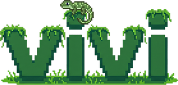

<p align="center">
  
</p>

<p align="center">
  A self-hosted sandbox for AI coding agents.<br/>
  Full autonomy inside, full control outside.<br/>
  No permission prompts, no leaked secrets, no vendor lock-in.
</p>

---

Vivi gives your AI coding agent its own isolated Docker container with full git, Docker-in-Docker, and internet access — while keeping your secrets, credentials, and repo metadata on your machine. The agent runs with zero permission prompts. You approve what leaves the sandbox.

Currently built around [Claude Code](https://docs.anthropic.com/en/docs/claude-code), with the architecture designed to support other CLI-based agents.

## Isolation

Your agent gets a full Linux environment. What it *doesn't* get is your secrets.

- **Git bundle cloning** — only tracked files enter the sandbox. `.env`, credentials, `node_modules`, gitignored files — none of it.
- **MITM proxy** — all sandbox traffic routes through a TLS-intercepting proxy. API keys are injected at the proxy layer, so the sandbox only ever sees placeholder tokens.
- **Network allowlist** — only approved hosts are reachable (npm, GitHub, Anthropic API by default). Everything else gets a 403.
- **Credential proxy** — git and `gh` credentials come from your host's existing setup (`git credential fill` / `gh auth token`). Zero config inside the sandbox.
- **Docker namespace proxy** — per-session socket proxy prevents containers from escaping their session or escalating privileges.

All restrictions are enforced at the network/proxy layer, not with CLI wrappers. The sandbox physically cannot bypass them.

## Git workflow

The agent has full git inside the sandbox. What it can't do is push to your remote without your say-so.

- **`git push` interception** — pushes are caught at the proxy and surfaced in the UI for approval. You choose: pull the branch locally, or create a real GitHub PR.
- **`gh pr create` interception** — same deal. PR title and description are editable before submission.
- **Direct push/pull** — a git daemon runs in every sandbox. You can `git push`/`git pull` to the sandbox in real time from your terminal.
- **Co-authored commits** — all PRs are automatically attributed to both you and the agent.

## Supervision

Watch what the agent is doing. Step in when it's stuck.

- **Live terminal** — full PTY into the sandbox, persistent across tab switches and reconnects.
- **Live diff viewer** — see what the agent has changed in real time, before it pushes anything.
- **Container logs** — tail, refresh, and copy stdout/stderr from the sandbox.

## Infrastructure

Each session gets its own container. Run as many as you want.

- **Multi-session** — independent sandboxes in separate tabs, each with their own container, git state, and terminal.
- **Docker-in-Docker** — the agent can launch its own containers (dev servers, databases, build tools) with per-session namespace isolation.
- **Port forwarding** — `open-port 3000` inside the sandbox creates a clickable localhost link in the UI. Works for both sandbox processes and DinD containers. Set `PUBLIC_PORT_URL_BASE=https://your-domain.tld` to emit flat HTTPS links (`https://p-3000-{sessionPrefix}.your-domain.tld`) instead — handy behind Cloudflare tunnels where free Universal SSL only covers a single-level wildcard.
- **Custom sandbox images** — register your own Docker images with pre-installed tools. Pick one per session or set a default.
- **Profiles** — named Claude profiles that persist `~/.claude` state across sessions (memory, settings, project context).
- **GitHub Issues integration** — launch sessions directly from issues. The issue description becomes the task.
- **Self-updating** — Claude Code can update itself inside the sandbox via the native installer.

## Quick start

### Prerequisites

- [Docker Desktop](https://www.docker.com/products/docker-desktop/) (or Docker Engine + Compose v2) or [Podman](https://podman.io/)
- `git` and `gh` CLI

### Install

Grab the `vivi` binary for your platform from the [latest release](https://github.com/telus-oss/vivi/releases/latest), `chmod +x`, and drop it in your `$PATH`. Then:

```bash
vivi start
```

Open `http://localhost:7700`. Add your API key in the Secrets tab (or use "Login with Claude" for OAuth). Point it at a repo, give it a task, and watch it work.

```bash
vivi status     # show service status
vivi logs app   # tail logs
vivi update     # pull the latest compose + images
vivi stop       # shut it down
vivi path       # print resolved config / data dirs
```

Config and data live in platform-native locations by default:

| OS | Config | Data |
|----|--------|------|
| Linux | `$XDG_CONFIG_HOME/vivi` (~/.config/vivi) | `$XDG_DATA_HOME/vivi` (~/.local/share/vivi) |
| macOS | `~/Library/Application Support/vivi` | `~/Library/Application Support/vivi` |
| Windows | `%APPDATA%\vivi` | `%LOCALAPPDATA%\vivi` |

Override with `VIVI_CONFIG_DIR`, `VIVI_DATA_DIR`, or `VIVI_HOME` (sets both).

### Development

Contributors running against the source tree don't need the CLI:

```bash
bun install
docker build -t vivi-sandbox -f docker/Dockerfile.sandbox .
bun dev
```

Open `http://localhost:5173`. Dev mode keeps `config/` and `data/` in the repo checkout so state doesn't leak into your user home.

## How it works

See [docs/architecture.md](docs/architecture.md) for the full architecture, component breakdown, request flows, and security model.

## Scripts

| Command | What |
|---------|------|
| `bun dev` | Server + UI with hot reload |
| `bun run dev:server` | Server only |
| `bun run dev:ui` | Vite UI only |
| `bun run build` | Production frontend build |
| `bun run build:cli` | Compile the `vivi` CLI binary to `dist/bin/vivi` |
| `bun run build:docker` | Build all Docker images |
| `bun start` | Production server |
| `bun test` | Run tests |

## License

MIT
